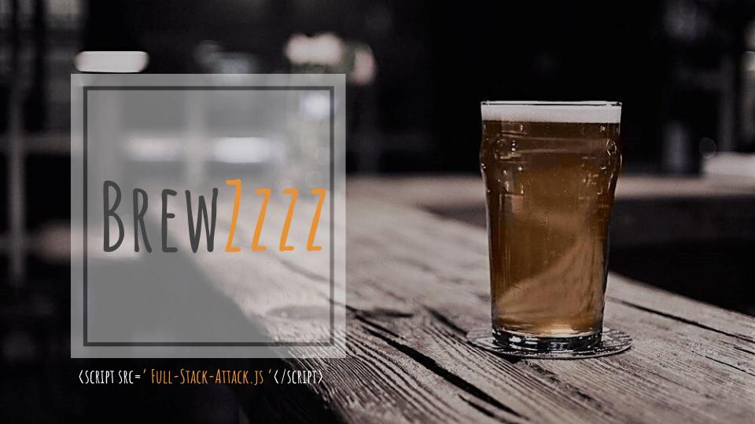

# Brewery Finder Application

# apis used
https://foursquare.com/developers/apps

https://developers.google.com/places/web-service/autocomplete

https://openweathermap.org/api

https://www.openbrewerydb.org

# css framework
materialize

# authentication and database
firebase

# Website
https://jhoyos135.github.io/Brewery_finder_app/

